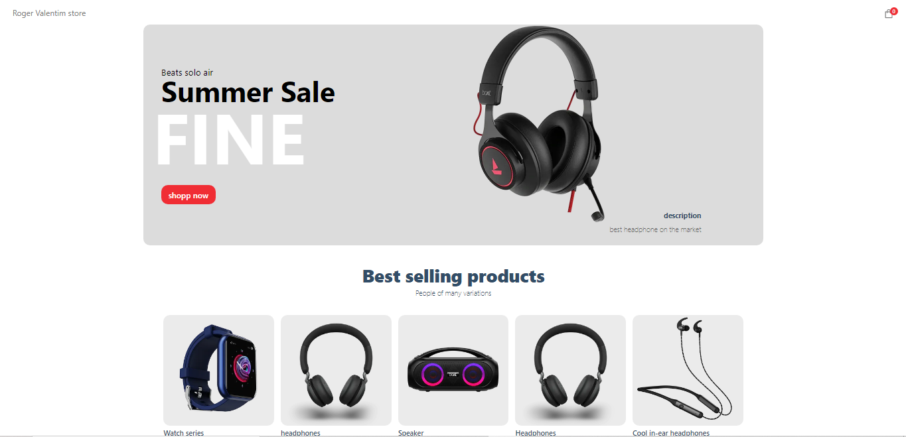

<h1 align="center">Ecommerce</h1>

Ecommerce com a funcionabilidade de carrinho e com pagamento final

  <a href="#-tecnologias">Tecnologias</a>&nbsp;&nbsp;&nbsp;|&nbsp;&nbsp;&nbsp;
  <a href="#-projeto">Projeto</a>&nbsp;&nbsp;&nbsp;|&nbsp;&nbsp;&nbsp;

 

<!-- <h2>Página com detalhes do produto, e com a funcionabilidade de adicionar os produtos selecionados para o carrinho </h2>

   

 

<h2>Carrinho</h2>

   

 

<h2>tela de Pagamento com Stripe</h2>

   

 

<h2>Compra finalizada com sucesso ! </h2>

   

 

<h2>Sanity</h2>

   

 -->

<video width="100%" src=".github/video.mp4">

# #🚀 Principais Tecnologias e Ferramentas

- NEXT JS
- SANITY
- STRIPE
- API
- TOAST

